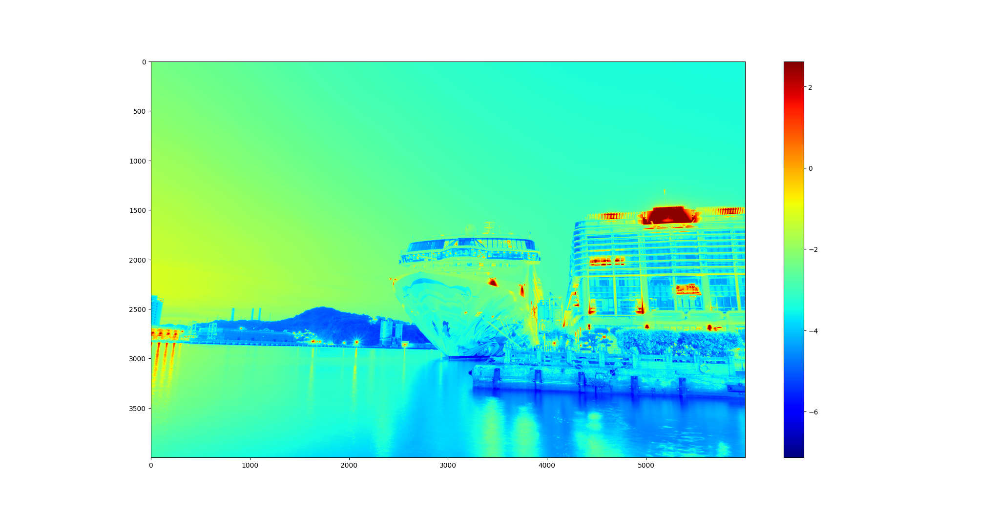
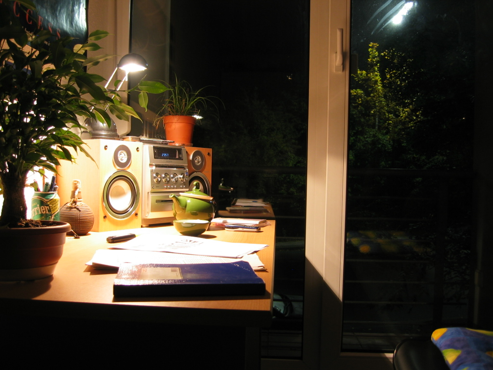
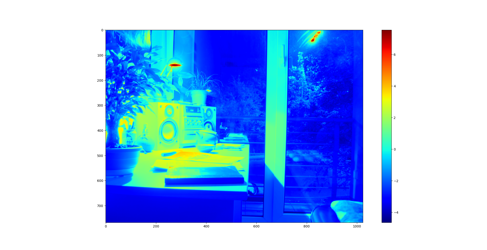

# VFX Project1 HDR
Calculate HDR image using multi-exposure images.

We implemented `Image Alignment using MTB`, `Solve Response Curve`, `Radiance Map` and `Tone Mapping`.

> NTUST CGLab M11015117 湯濬澤\
> NTUST CGLab M11015029 張立彥

## Environment
```
Python 3.8
    opencv-python
    Pillow
    numpy
    tqdm
    exifread
    matplotlib
    ...
```

## Install
```
conda create --name VFX python=3.8
conda activate VFX
pip install -r requirements.txt
```

## Run
-i --input_dir INPUT_DIR\
-a --align_img `True` / `False`\
-s --sample_method `uniform` / `random` 
```
python main.py -i INPUT_DIR -a ALIGN_IMG_OR_NOT -s SAMPLE_METHOD
```

## 成果
### 曾經風光的巨輪　＠基隆港
#### 原圖

#### Response Curve

#### Radiance Map

#### HDR 結果


### 範例
#### 原圖

#### Response Curve

#### Radiance Map

#### HDR 結果


## 演算法
整體架構由 `main.py` 作為主要程式執行的區塊，而依據不同功能切割成 `hdr_utils.py`、`img_alignment.py`、`ToneMapping.py` 三個檔案。
程式執行首先會透過 argparse 取出我們所需要的參數，如圖片資料夾、是否對齊圖片、採樣方式等。

```python
def get_parser():
    parser = argparse.ArgumentParser(description='my description')
    parser.add_argument('-i', '--input_dir', default='./imgs', type=str)
    parser.add_argument('-a', '--align_img', default='True', type=str)
    parser.add_argument('-s', '--sample_method', default='uniform', type=str)
    return parser
```

### Alignment
接下來如有圖片對齊，則先將所有圖片做 MTB，MTB 算法是將圖片轉成灰階後，對灰階值做排序，找到中值代表的顏色後，針對那個顏色對圖片做二值化，同時針對在 Threashold +- 10 的像素產生 Mask。
* MTB

* Mask

之後對讀入的圖片依亮度做排序，選出中間值，作為 Reference image。並將所有圖片縮小 $2^{log2(min(height, width)) - 4}$ 倍。

以九宮格為移動方式
| -1, -1 | 0, -1 | 1, -1 |
| :----: | :----: | :----: |
| -1, 0 | 0, 0 | 1, 0 |
| -1, 1 | 0, 1 | 1, 1 |

將 MTB 圖片移動，對移動後的圖片做 a_img Xor b_img and mask，並取 sum()，找到 sum 最小的位置，將圖片移動。移動後，則將圖片解析度 ×2，重複以上動作直到回到圖片原始解析度大小。最終會得到圖片位移的 Offset，並依據這 Offset 做裁切。

## Response Curve
由於解 Response Curve 需要曝光時間作為參數，因此我們透過套件將圖片的 Exif 資訊讀入，可以拿到曝光時間。對其取 $log$ 後，對 RGB 三個 Channel 分別解 SVD，這邊主要參考[論文](http://www.pauldebevec.com/Research/HDR/debevec-siggraph97.pdf)附上的 Matlab Code。

```python
x = np.linalg.lstsq(A, b, rcond=None)[0]
```
 Response Curve


Sample 點部分有試過 Random 100 個點，以及將圖片縮到 10X10 去解，有發現縮到 10X10 的效果比較好。

## Radiance Map
Radiance Map 做法其實不難，照著公式實做就好，這邊遇到比較麻煩的問題是運算時間太久。一張 2400 萬畫素的圖片需要處理個 40 分鐘，因此後來將程式用 numpy 改寫，速度可以快到 40 秒內。

$ln E_i = \frac{\sum_{j=1}^P w(Z_{ij})(g(Z_{ij}) - ln\Delta t_j)}{\sum_{j=1}^P w(Z_{ij})}$

其中 g 函式即為剛剛求得的 Response Curve。


